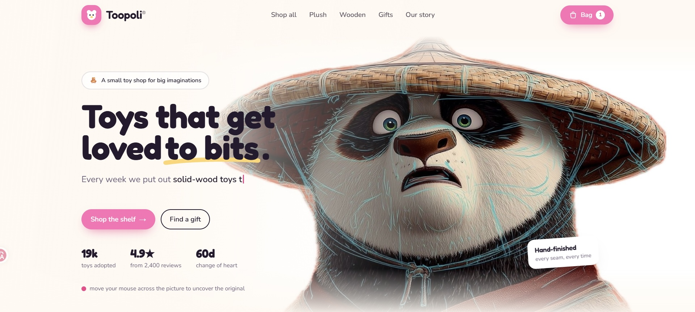

# Toopoli — Toy Shop Demo

A demo storefront for **Toopoli**, a fictional toy shop. It is a single-page
site built with React 19, TypeScript and Tailwind CSS 4, and it has a working
shopping cart.

> **This is a demo project, not a real shop.** Toopoli, its products, prices,
> reviews and stats are all made up. Nothing can be bought, and no data is sent
> anywhere.



## Demo


<!--
  To add the demo recording: save it as docs/demo.gif and it will show up here
  on its own. Keep it under ~10 MB so GitHub renders it inline.
-->

## Features

### Hero

- **Cursor reveal.** The hero artwork appears as a line sketch. Move the mouse
  across it and a soft-edged lens shows the full-colour original underneath.
  The lens moves with composited transforms, not a repainted mask, so it stays
  smooth.
- **Typewriter tagline** that cycles through several lines.
- **Pointer parallax** on the hero layers. One shared animation loop drives it
  and stops once everything has settled.

### Shop

- Product grid with ratings, review counts, age labels, badges and sale prices.
- Filters: **Everything**, **Plush**, **Wooden** and **Under £40**.

### Shopping cart

- **Add to bag** on every product card, with a short confirmation on the button.
- A **slide-in drawer** that lists each toy with a quantity stepper, a remove
  button, a live subtotal and how much more you need to spend for free delivery
  (over £50).
- The bag is **saved in `localStorage`**, so it survives a reload. Only product
  ids and quantities are stored. Names and prices are looked up again when the
  page loads, so an old bag can't bring back an old price.
- Close it with **Escape**, the close button, or by clicking outside it. The
  page behind it doesn't scroll while it is open.
- A live item count in the header. On phones it becomes a compact icon.

### Other sections

- **Pick an aisle**: shop categories.
- **Gift finder**: toys grouped by the child's age.
- **Our story**: the brand story section.
- **Testimonials**: customer reviews.
- **Newsletter**: a sign-up form that only works in the browser and sends
  nothing.

### General

- Fully responsive, with a full-screen mobile menu.
- Sections fade in as they scroll into view.
- Honours `prefers-reduced-motion`: animations are turned off for people who ask
  for less motion.
- Photo slots handle missing files: if an image isn't there yet, its tinted
  frame keeps the same size and the layout doesn't move. See
  [PHOTOS.md](PHOTOS.md).

## Tech stack

| | |
| --- | --- |
| UI | [React 19](https://react.dev) |
| Language | [TypeScript 5](https://www.typescriptlang.org) |
| Styling | [Tailwind CSS 4](https://tailwindcss.com) (design tokens in `@theme`) |
| Build tool | [Vite 7](https://vite.dev) |
| State | React Context, persisted to `localStorage` |

There is no backend and no state-management library. The cart is a small
Context provider.

## Getting started

You need **Node.js 20.19 or newer** (Vite 7 requirement).

```bash
# install dependencies
npm install

# start the dev server at http://localhost:5173
npm run dev

# type-check and build for production into dist/
npm run build

# serve the production build locally
npm run preview
```

## Project structure

```
├── docs/                   README images (preview, demo GIF)
├── public/                 static files served as-is
│   ├── panda-*.jpg         hero artwork (sketch + original)
│   ├── products/           product photos     ┐
│   ├── categories/         category photos    │ optional — see PHOTOS.md
│   ├── ages/               gift-finder photos │
│   └── story/              story photo        ┘
└── src/
    ├── App.tsx             page layout and section order
    ├── index.css           design tokens, buttons, cards, animations
    ├── components/         one file per section, plus shared pieces
    │   ├── Hero.tsx
    │   ├── HeroBackdrop.tsx    cursor-reveal artwork
    │   ├── Shop.tsx            product grid + filters
    │   ├── ProductCard.tsx
    │   ├── CartDrawer.tsx      the bag
    │   ├── Navbar.tsx
    │   └── …
    ├── data/
    │   └── shop.ts         products and categories
    └── hooks/
        ├── useCart.tsx     cart state, provider and persistence
        ├── useParallax.ts
        ├── useReveal.ts
        └── useTypewriter.ts
```

## Adding photos

Products, categories, age groups and the story section each have a slot for a
photo. To fill one, put an image at the matching path in `public/`. You don't
need to change any code. [PHOTOS.md](PHOTOS.md) lists every file name and the
best size for each slot.

## Notes

- **Checkout isn't connected.** The button is there to finish the design but
  doesn't go anywhere. There is no payment provider or order backend.
- The hero artwork is used here for demonstration only.
